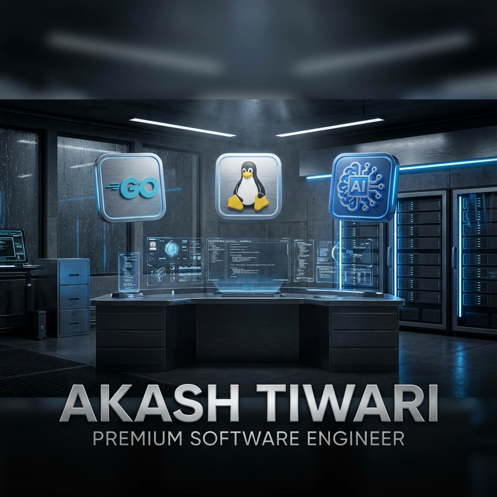
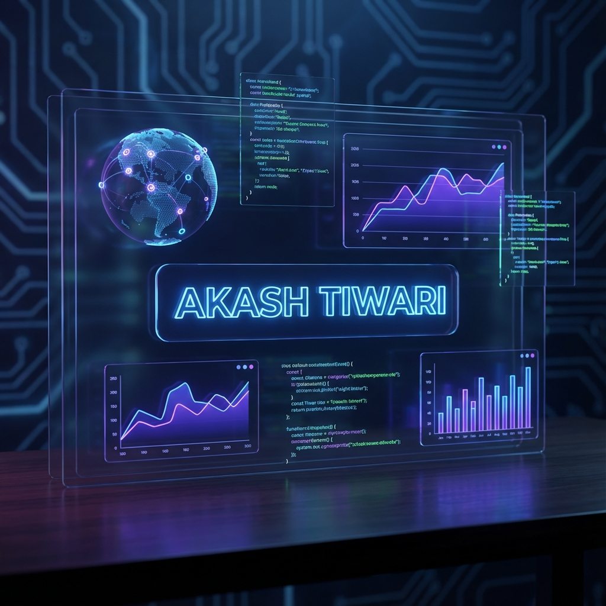

# 💫 About Me

  

 

  

  
  

 

---

### 🎓 Education & Background
- **Institution**: Final Year Student at **Birla Institute of Technology (BIT)**.
- **Focus**: High-performance systems, HR-Tech, and AI-driven automation.
- **Philosophy**: "Building the bridge between human potential and technical excellence."

 

---

### 🚀 Featured Projects

| Project | Description | Tech Stack |
|:---|:---|:---|
| **🌊 TalentFlow** | A premium React-based platform designed for HRs to streamline hiring flows. | React, Redux, Node.js |
| **🤖 JARVIS AI** | Advanced AI integrated assistant with voice recognition and command execution. | Python, OpenAI, JS |
| **🐹 Go Systems** | High-performance backend services and CLI tools built with GoLang. | Go, gRPC, Docker |
| **🐧 Linux UI** | Custom professional desktop experience and kernel optimization scripts. | Bash, C, GTK |

 

---

### 🛠 My Tech Stack

  
  
  
  

  
  
  
  

 

---

### 📊 Performance & Analytics

  

 

<!-- 
IMPORTANT: Replace 'YOUR_GITHUB_USERNAME' with your actual GitHub username in all links below to see your live stats!
-->

  
  

 

  

---

  Configured with ❤️ for Akash Tiwari

